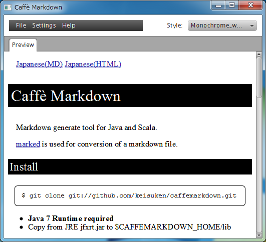

[English(MD)](README.md)
[English(HTML)](README.html)


# Caffè Markdown

JavaおよびScala用のMarkdown変換ツールです。

内部で[marked](https://github.com/chjj/marked)を使っています。





## 導入

```
$ git clone git://github.com/keisuken/caffemarkdown.git
```

* **Java 7ランタイムが必要です**
* Copy from JRE jfxrt.jar to $CAFFEMARKDOWN_HOME/lib


## 使い方


### コマンドライン

Windowsの場合:

```
caffemd [options] files...
```

MacまたはLinuxの場合:

```
caffemd.sh [options] files...
```

例(Windowsの場合):

```
caffemd -style default example.md
```


#### Usage

```
Usage: caffemd [options] file...
Options:
  -help               Display this information
  -version            Display version information
  -style <style_name> Set output style
  -wkhtmltopdf <wkhtmltopdf_path>
                      Set wkhtmltopdf execution path
  -pdf                Output PDF file
```


### GUI(Java FX)

caffemdgui.bat or caffemdgui.shをクリックして起動してください


#### 設定

##### wkhtmltopdfの選択

1.メニューバーの "Settings" - "select wkhtmltopdf" を実行
2.wkhtmltopdf(HTML to PDFコンバータ)実行ファイルを選択

##### PDF出力

もしPDFを出力したい場合は、"output to PDF" メニューアイテムをチェックしてください。


#### Markdownファイルのオープンと変換

メニューバーの "File" - "Open and generate" メニューアイテムを実行。


### Scala

```
import jp.cappuccino.tools.markdown.Markdown
...

// Create markdown generator.
val markdown = new Markdown

// Generate HTML.
val source = "# Header\n\nHello, Markdown tool!"
val style = Style.load(".", Style.Default)
val title = "Hello, Markdown!"
val html = markdown.generate(source, style, title)

// Print HTML.
println(html)
```

```
import jp.cappuccino.tools.markdown.Markdown
...

// Generate Markdown file.
val home = new File(".")
val styleName = Style.Default
val inpFile = new File("example.md")
val html = Markdown.generate(home, styleName, inpFile)

// Print HTML.
println(hrml)
```


## API Reference

[Caffè Markdown](docs/api/index.html) を見てください。


## License

Copyright (C) 2014, NISHIMOTO Keisuke. (MIT License)

詳しくは、以下をご確認ください。

* [LICENSE](LICENSE.txt)
* [marked LICENSE](marked-LICENSE.txt)
* [Scala LICENSE](Scala-LICENSE.txt)
